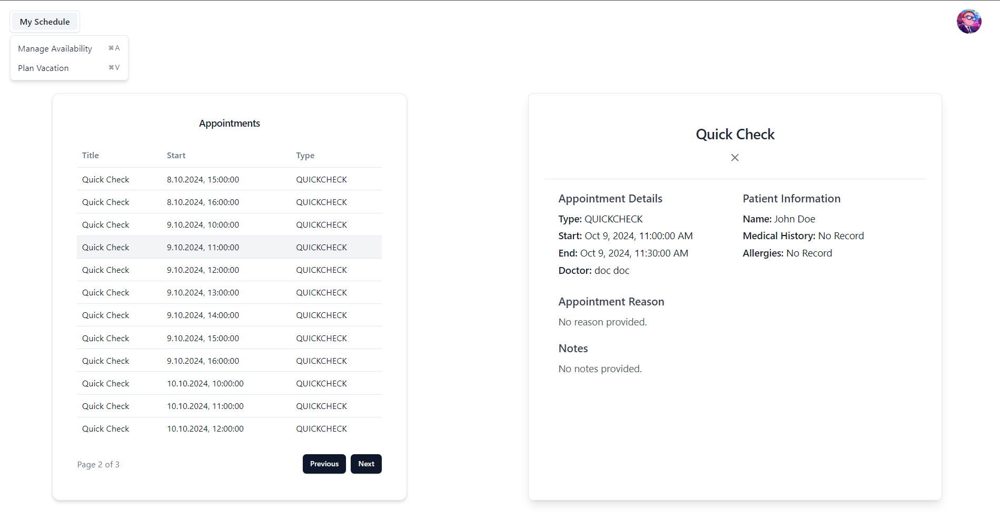
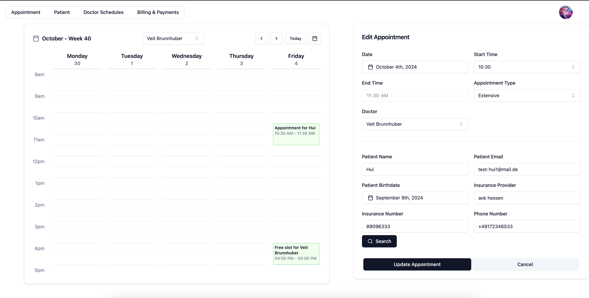
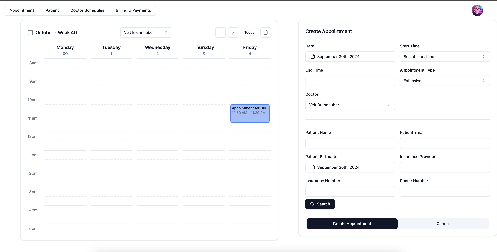
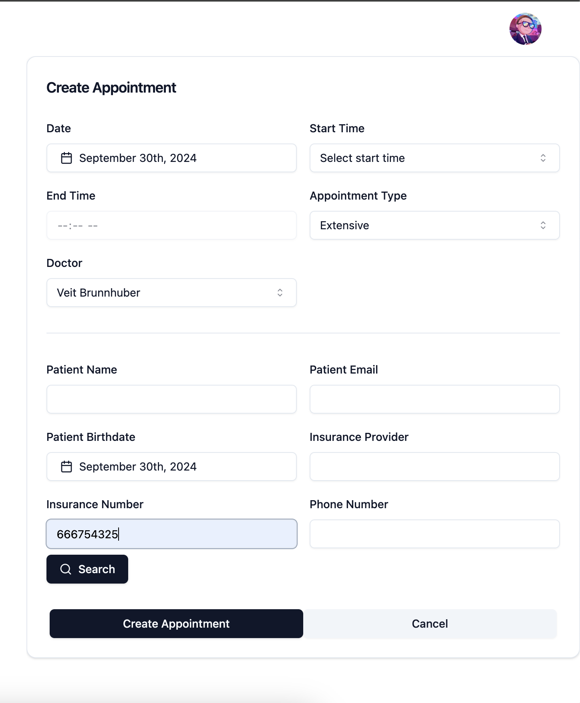
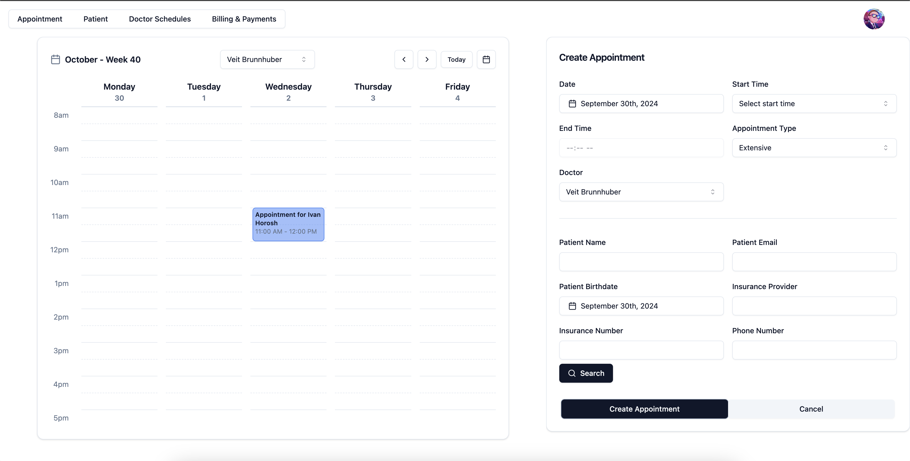
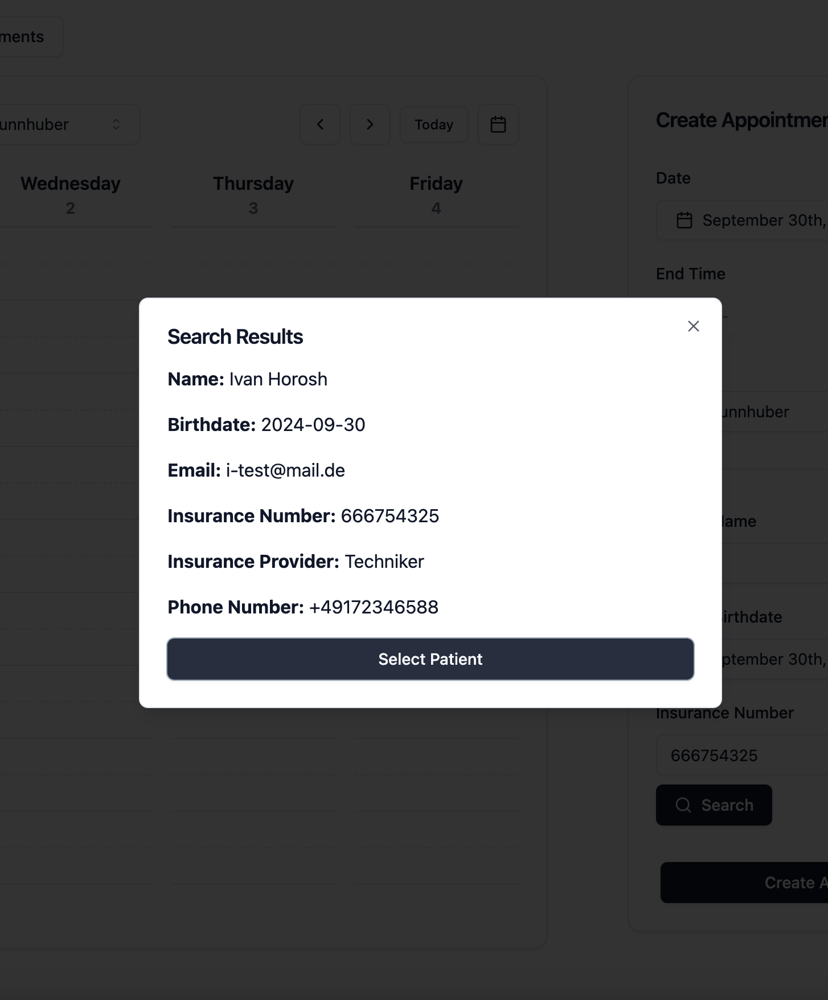
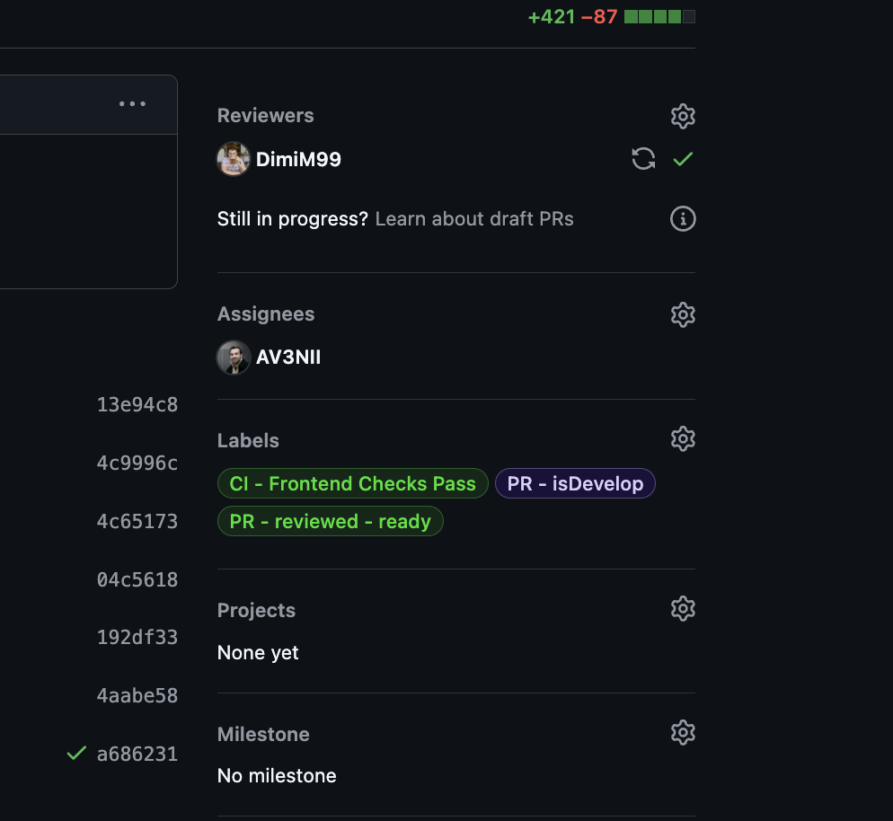
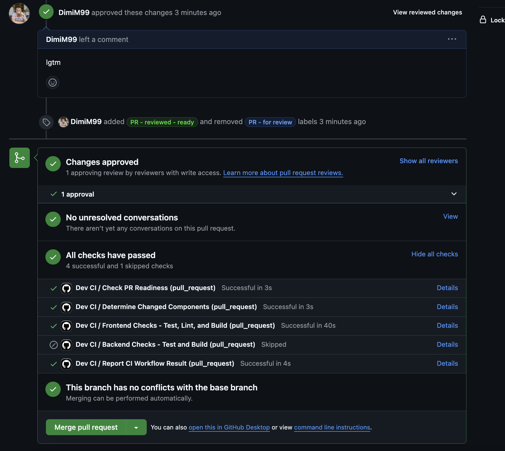

# SmileScheduler Appointment System - Collaboration Documentation

## Project Overview
The Clinic Appointment System was developed to streamline appointment 
scheduling for a dentistry clinic. The project aimed to create a scalable 
solution with clear separation between the backend and frontend, using Git 
for version control, continuous integration, and an organized project management system.

### Development Process

1. **Git Workflow and Branching Strategy**
   - We used **Git** as our version control system, separating the project 
   into **backend** and **frontend** parts initially.
   - The development was done through a structured branching strategy:
     - **Main branch**: Stable production-ready code.
     - **Development branch**: Code under active development.
     - **Feature branches**: Specific tasks or features.
   - Rollout pull requests (PRs) were made to the main branch as sprint goals 
   to ensure stable development stages.

2. **Continuous Integration (CI) Pipeline**
   - We set up a **CI pipeline** that automatically ran ESLint, built the project, 
   and executed all available tests.
   - **Backend**: Full unit and integration testing was implemented.
   - **Frontend**: Unfortunately, no tests were included due to time constraints.

3. **Branch Protection and Code Review**
   - Branch protection rules were enforced to require proper code review before 
   merging PRs. This ensured high-quality code was delivered.
   - Labels were applied to tickets and PRs for efficient tracking of their status. 
   These labels included:
     - **Ticket labels**: `frontend`, `backend`, `infra`
     - **PR status labels**: `CI - backend checks failed`, `CI - frontend checks failed`,
      `CI - backend checks passed`, `CI - frontend checks passed`, `PR - is rollout`, 
      `PR - for review`, `PR - working`, `PR - reviewed changes needed`, 
      `PR - reviewed ready`, `PR - stuck waiting`.

4. **Ticket Management**
   - We managed our tasks through **GitHub Projects**, keeping track of ticket status 
   and progress.
   - The ticket states were regularly updated and we had a comprehensive label system 
   for clear communication.
   - Rollout PRs represented the achievement of sprint goals, with tickets reflecting 
   the current state of progress.

5. **Collaboration and Communication**
   - Initially, meetings were held **every second day** during the first two weeks, which 
   then shifted to **daily meetings** to ensure constant alignment.
   - **Co-programming sessions** were organized to debug and fix critical issues 
   collaboratively, helping to speed up development.

6. **Mockups and Functional Specifications**
   - Before diving into development, we created **mockups** and sketched out the functional 
   specifications of the software.
   - This planning phase ensured that the software included all the essential features from 
   the start.

### Challenges and Refactoring
1. **Appointment Details Refactoring**
   - During the project, we realized that we had overlooked adding **notes** and 
   **reasons for appointments** to the appointment details. Additionally, we extended the 
   **patient entity** with a health history.
   - Refactoring these aspects took **4 hours** and was critical, as it was not initially 
   accounted for in our plan.

2. **Code Quality and Assessment**
   - We assessed code quality using **IntelliJ tools** throughout the project, ensuring 
   adherence to clean code principles.
   - The use of code quality tools helped maintain a consistent standard of code across the team.

### Tools and Technologies
- **Version Control**: Git, GitHub
- **Project Management**: GitHub Projects
- **CI Pipeline**: Custom pipeline with ESLint and automated tests
- **Documentation**: MkDocs for project documentation
- **Testing**:
  - **Backend**: Full unit and integration tests
  - **Frontend**: No tests due to time constraints

### Time Management and Constraints
- The project was started as soon as it was assigned, but due to other responsibilities, 
we had approximately **3 working days per week** dedicated to the project.
- While the **deadline was tight**, we managed to deliver a version that is in a good state 
for further development and is scalable.
- Not all planned features were implemented, but the foundation is solid for future work.

### Future Development
- Implementing **frontend testing** is a high priority for future sprints.
- Further enhancements to the appointment system, such as **automated doctor rescheduling**, 
are planned for future development stages.

### Screenshots out of development

---

---

---

---

---

---

---

---

---

---

